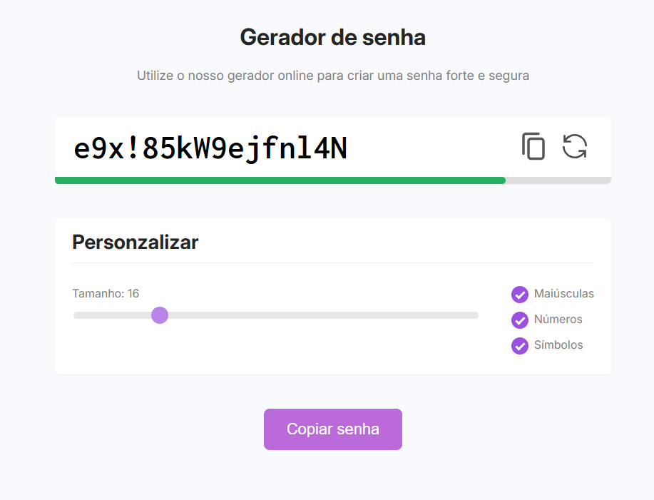

# 🔐 Gerador de Senha

Um **gerador de senhas online** simples e intuitivo, desenvolvido em **HTML, CSS e JavaScript**.  
Permite criar senhas fortes e seguras com personalização de tamanho e tipos de caracteres (maiúsculas, números e símbolos).

---

## 🚀 Demonstração

---

## 🧩 Funcionalidades

- Geração automática de senhas seguras  
- Personalização do tamanho da senha (4 a 64 caracteres)  
- Inclusão opcional de letras maiúsculas, números e símbolos  
- Barra indicadora de segurança da senha  
- Botões para copiar e gerar nova senha rapidamente  
- Feedback visual ao copiar a senha  

---

## 🖥️ Tecnologias Utilizadas

- **HTML5**
- **CSS3**
- **JavaScript (ES6+)**
- **Google Fonts (Inconsolata e Inter)**

