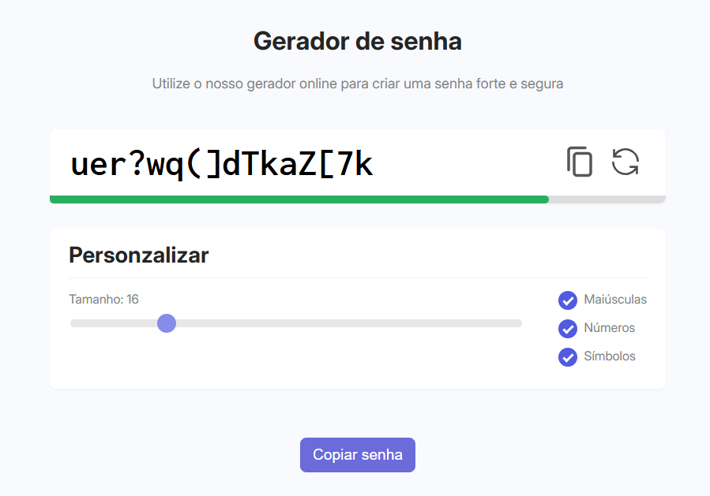

# 🔐 Gerador de Senha

Um **gerador de senhas online** simples e intuitivo, desenvolvido em **HTML, CSS e JavaScript**.  
Permite criar senhas fortes e seguras com personalização de tamanho e tipos de caracteres.

---

## 🌐 Acesse o Projeto

👉 [Gerador de Senha Online](https://gerador-senha-javascript.vercel.app)

---

## 🚀 Demonstração

---

## 🧩 Funcionalidades

- Geração automática de senhas seguras
- Personalização do tamanho da senha (4 a 64 caracteres)
- Inclusão opcional de letras maiúsculas, números e símbolos
- Barra indicadora de segurança da senha gerada
- Botões para copiar e gerar nova senha rapidamente
- Feedback visual ao copiar a senha

---

## 🖥️ Tecnologias Utilizadas

- **HTML5**
- **CSS3**
- **JavaScript (ES6+)**
- **Google Fonts (Inconsolata e Inter)**
